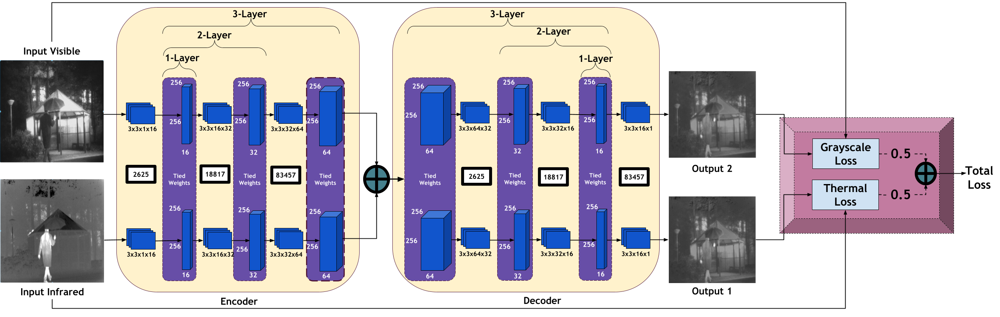

# Readme

This repository is the official implementation of SiameseFuse: A computationally efficient and a not-so-deep network to fuse visible and infrared images.
### Run
You can run SiameseFuse.ipynb on Google Colab after changing path of npy files.
### Citation
```
@article{OZER2022108712,
title = {SiameseFuse: A computationally efficient and a not-so-deep network to fuse visible and infrared images},
journal = {Pattern Recognition},
volume = {129},
pages = {108712},
year = {2022},
issn = {0031-3203},
doi = {https://doi.org/10.1016/j.patcog.2022.108712},
url = {https://www.sciencedirect.com/science/article/pii/S0031320322001935},
author = {Sedat Özer and Mert Ege and Mehmet Akif Özkanoglu},
keywords = {Multi-temporal fusion, Efficient learning, Multi-modal fusion},
abstract = {Recent developments in pattern analysis have motivated many researchers to focus on developing deep learning based solutions in various image processing applications. Fusing multi-modal images has been one such application area where the interest is combining different information coming from different modalities in a more visually meaningful and informative way. For that purpose, it is important to first extract salient features from each modality and then fuse them as efficiently and informatively as possible. Recent literature on fusing multi-modal images reports multiple deep solutions that combine both visible (RGB) and infra-red (IR) images. In this paper, we study the performance of various deep solutions available in the literature while seeking an answer to the question: “Do we really need deeper networks to fuse multi-modal images?” To have an answer for that question, we introduce a novel architecture based on Siamese networks to fuse RGB (visible) images with infrared (IR) images and report the state-of-the-art results. We present an extensive analysis on increasing the layer numbers in the architecture with the above-mentioned question in mind to see if using deeper networks (or adding additional layers) adds significant performance in our proposed solution. We report the state-of-the-art results on visually fusing given visible and IR image pairs in multiple performance metrics, while requiring the least number of trainable parameters. Our experimental results suggest that shallow networks (as in our proposed solutions in this paper) can fuse both visible and IR images as well as the deep networks that were previously proposed in the literature (we were able to reduce the total number of trainable parameters up to 96.5%, compare 2,625 trainable parameters to the 74,193 trainable parameters).}
}
```